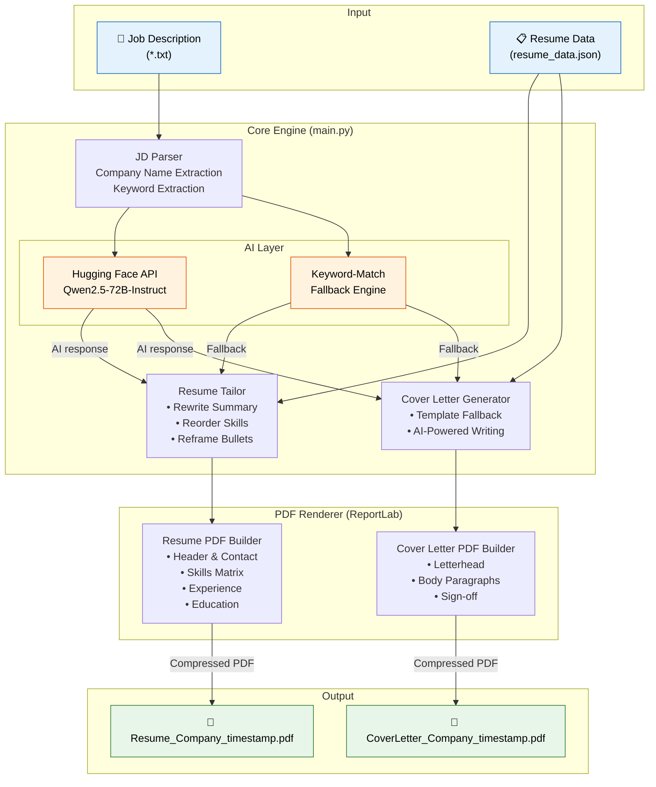
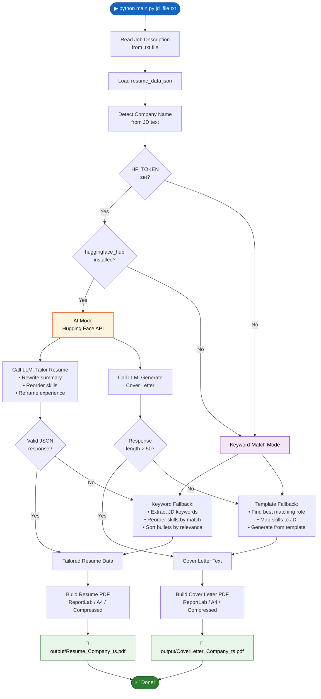

# Resume Updater & Cover Letter Generator

A CLI utility that takes a **Job Description** (`.txt`) as input, tailors your resume and generates a cover letter as **compressed PDFs**.

Uses **Hugging Face Inference API** (free tier, Qwen2.5-72B) for AI-powered tailoring, with an automatic keyword-matching fallback when no API is available.

## Architecture



## Execution Flow



## Setup

```bash
pip install -r requirements.txt
```

### AI Mode (recommended)

Get a free token at [huggingface.co/settings/tokens](https://huggingface.co/settings/tokens) with **Inference Providers** permission enabled.

```bash
export HF_TOKEN="hf_your_token_here"
```

### Keyword-Match Mode (no token needed)

Works out of the box — parses JD for keywords, reorders skills/bullets, and generates a template-based cover letter.

## Usage

```bash
python main.py <jd_file.txt> [--output output_dir]
```

### Examples

```bash
# Basic usage
python main.py job_posting.txt

# Custom output directory
python main.py job_posting.txt --output ./pdfs
```

## Output

Two compressed PDF files named after the detected company:

```
output/Resume_FDJ_UNITED_20260420_103807.pdf
output/CoverLetter_FDJ_UNITED_20260420_103807.pdf
```

## Files

| File | Purpose |
|------|---------|
| `main.py` | Main utility script |
| `resume_data.json` | Your structured resume data (edit with your details) |
| `requirements.txt` | Python dependencies |
| `sample_jd.txt` | Example job description for testing |
| `.env.example` | Template for environment variables |

## How It Works

1. Reads your base resume from `resume_data.json`
2. Reads the job description from the input `.txt` file
3. Detects the company name from the JD for output file naming
4. Uses Hugging Face LLM (or keyword matching) to tailor summary, skills, and experience bullets
5. Generates a matching cover letter
6. Renders both as professionally formatted, compressed PDFs
