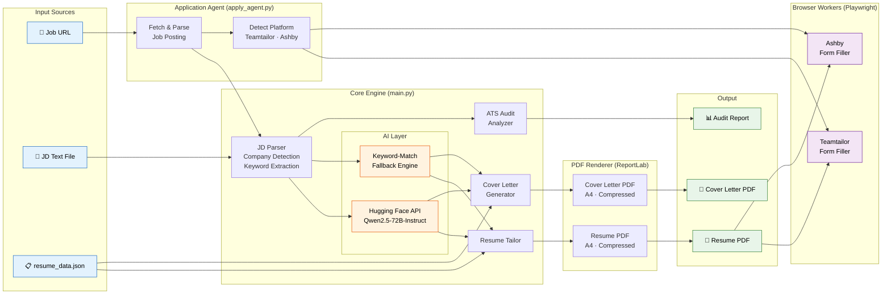
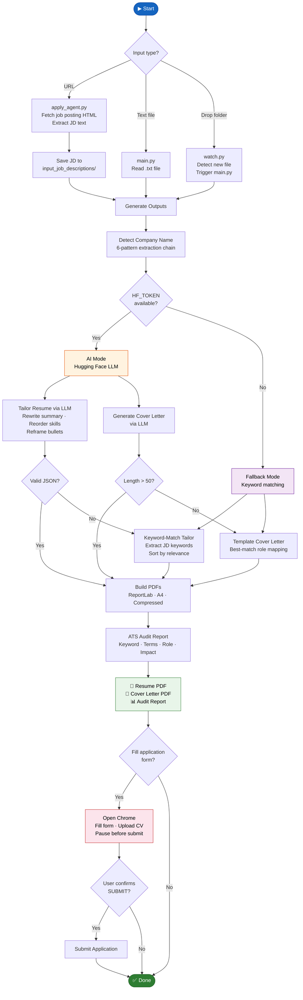

# Resume Tailoring & Application Automation Platform

An end-to-end CLI platform that takes a **Job Description** as input, tailors a resume using AI, generates a cover letter, produces an ATS match audit report, and optionally fills online application forms — all automated.

Built with Python, Hugging Face LLMs, and headless browser automation.

---

## What It Does

| Capability | Description |
|---|---|
| **Resume Tailoring** | Rewrites summary, reorders skills, reframes experience bullets to match a JD |
| **Cover Letter Generation** | Produces a tailored cover letter referencing specific resume achievements |
| **ATS Audit Report** | Scores keyword match, required terms, role alignment, and bullet impact |
| **Application Form Filling** | Automates Teamtailor and Ashby form filling with resume upload |
| **File Watcher** | Drop a `.txt` JD file in a folder → auto-generates all outputs |
| **Dual-Mode Engine** | AI-powered (Hugging Face LLM) with automatic keyword-match fallback |

---

## Architecture



---

## Execution Flow



---

## Project Structure

```
resume_updator/
├── main.py                        # Core engine: tailor, generate, audit, render PDFs
├── apply_agent.py                 # URL-based application agent with browser automation
├── watch.py                       # File watcher: auto-process new JD files
├── resume_data.json               # Candidate profile data (skills, experience, education)
├── application_agent_config.json  # Default form answers and browser settings
├── browser_fill_teamtailor.js     # Playwright worker: Teamtailor form automation
├── browser_fill_ashby.js          # Playwright worker: Ashby form automation
├── browser_render_page.js         # Playwright worker: render JS-heavy pages
├── requirements.txt               # Python dependencies
├── input_job_descriptions/        # Raw JD text files (input)
├── processed_jds/                 # Archived JDs after processing
├── output/                        # Generated PDFs and audit reports (git-ignored)
├── AGENTS.md                      # AI agent instructions for automated workflows
└── .env                           # API tokens (git-ignored)
```

---

## Setup

### Prerequisites

- Python 3.10+
- Node.js (for browser automation, optional)

### Install

```bash
git clone https://github.com/<your_username>/resume_updator.git
cd resume_updator
pip install -r requirements.txt
```

### Configure AI Mode (recommended)

Get a free token at [huggingface.co/settings/tokens](https://huggingface.co/settings/tokens) with **Inference Providers** permission enabled.

```bash
# Option 1: Environment variable
export HF_TOKEN="hf_your_token_here"

# Option 2: .env file (git-ignored)
echo 'HF_TOKEN=hf_your_token_here' > .env
```

### Keyword-Match Mode (no token needed)

Works out of the box. Parses JD for keywords, reorders skills and bullets by relevance, and generates a template-based cover letter.

---

## Usage

### Generate tailored resume + cover letter + audit from a JD file

```bash
python3 main.py input_job_descriptions/job_posting.txt
```

### Generate from a job URL (fetch JD, generate, fill form)

```bash
python3 apply_agent.py "https://career.example.com/jobs/12345"
```

### Generate only (no form filling)

```bash
python3 apply_agent.py "https://career.example.com/jobs/12345" --no-fill
```

### Watch folder for new JD files (auto-process on drop)

```bash
python3 watch.py
```

### Custom output directory

```bash
python3 main.py input_job_descriptions/job_posting.txt --output ./pdfs
```

---

## Output

For each JD, three files are generated in `output/`:

| File | Description |
|---|---|
| `Resume_<Name>_<Company>.pdf` | Tailored resume with reordered skills and reframed bullets |
| `CoverLetter_<Name>_<Company>.pdf` | Personalized cover letter matching JD requirements |
| `ResumeAudit_<Name>_<Company>.md` | ATS match report with scores and recommendations |

### Audit Report Scores

The audit system evaluates four dimensions:

- **Keyword Score** — % of high-signal JD keywords found in the resume
- **Required Terms Score** — coverage of must-have technologies and tools
- **Role Alignment Score** — match against inferred role tracks (DevOps, Platform, SRE, etc.)
- **Impact Score** — % of experience bullets containing quantified metrics

---

## Key Features

### Company Name Extraction

Automatically detects company names from JD text using a 6-pattern extraction chain:

1. `<Company> is looking/seeking/hiring...`
2. `at <Company>` / `@ <Company>`
3. Filename-based fallback
4. Capitalized multi-word names (filtered for job titles)
5. Repeated proper nouns
6. First short line fallback

### Resume Tailoring (AI Mode)

- Rewrites professional summary to highlight JD-relevant experience
- Reorders skill categories by relevance
- Reframes experience bullets to emphasize matching achievements
- Never invents facts — only reframes existing experience

### Resume Tailoring (Keyword-Match Fallback)

- Extracts keywords from JD text
- Sorts skills by keyword overlap
- Reorders experience bullets by relevance score
- Zero external API calls required

### Application Form Automation

- **Teamtailor** — fills personal details, answers boolean questions, uploads CV
- **Ashby** — fills application form, attaches resume, handles custom questions
- Configurable default answers via `application_agent_config.json`
- **Submission is always confirmation-gated** — never auto-submits

---

## Tech Stack

| Component | Technology |
|---|---|
| Core engine | Python 3, ReportLab |
| AI tailoring | Hugging Face Inference API, Qwen2.5-72B-Instruct |
| NLP & matching | Regex-based keyword extraction, multi-pattern company detection |
| PDF generation | ReportLab (A4, compressed, professional styling) |
| Browser automation | Playwright (Node.js), Chrome/Chromium |
| File watching | watchdog |
| Configuration | JSON (resume data, form defaults) |

---

## License

MIT

### URL Application Agent

For supported job pages, you can now start from a job URL instead of manually
copying the description.

```bash
export HF_TOKEN="hf_your_token_here"
python apply_agent.py "https://jobs.doktor.se/jobs/7478835-senior-platform-engineer"
```

What it does:

1. Fetches the job posting URL and saves a JD text file in `input_job_descriptions/`
2. Runs `main.py` to generate the tailored resume, cover letter, and audit report
3. For supported ATS postings, opens Google Chrome, fills the application form from
   `resume_data.json` and `application_agent_config.json`, and uploads the generated CV
4. Keeps Chrome open for review and asks you to type `SUBMIT` before final submission

The final submit step is deliberately confirmation-gated because it sends your
application and personal details to a third party.

Useful options:

```bash
# Generate files only; do not fill the browser form
python apply_agent.py "<job_url>" --no-fill

# Fetch/save the JD only
python apply_agent.py "<job_url>" --no-generate

# Fill the form and leave it open without a submit prompt
python apply_agent.py "<job_url>" --no-submit-prompt
```

Default form answers live in `application_agent_config.json`. Current defaults:

- Authorized to work in `<country>`: `<yes/no>`
- Requires employer sponsorship: `<yes/no>`
- Can work from `<city>` office `<N>` days/week: `<yes/no>`
- Background-check consent: `<yes/no/ask>`
- Future job-offer consent: `<yes/no>`
- Submit requires confirmation: yes

Supported browser-fill providers:

- Teamtailor
- Ashby

Form filling uses the Node Playwright package. In Codex Desktop this
is available through the bundled runtime. Outside Codex, install it with:

```bash
npm install playwright
```

### Automated Watch Mode

```bash
# Watch the current project folder for new JD .txt files
python watch.py

# Process existing .txt files on startup too
python watch.py --process-existing

# Watch a dedicated inbox folder and store output elsewhere
python watch.py --dir ./incoming_jds --output ./output
```

By default, the watcher monitors `input_job_descriptions/` and moves successful inputs into `processed_jds/` so the same file is not reprocessed repeatedly. Use `--no-archive` if you want the `.txt` files to stay in place.

## Output

Two compressed PDF files and one markdown audit report named after the detected company:

```
output/Resume_<Name>_<Company>.pdf
output/CoverLetter_<Name>_<Company>.pdf
output/ResumeAudit_<Name>_<Company>.md
```

## Files

| File | Purpose |
|------|---------|
| `main.py` | Main utility script |
| `apply_agent.py` | URL-to-application agent orchestration |
| `application_agent_config.json` | Default application answers and browser settings |
| `browser_fill_teamtailor.js` | Teamtailor browser form filler |
| `resume_data.json` | Your structured resume data (edit with your details) |
| `requirements.txt` | Python dependencies |
| `watch.py` | Automated watcher for drop-folder processing |
| `input_job_descriptions/` | Inbox folder for job description `.txt` files |
| `.env.example` | Template for environment variables |

## How It Works

1. Reads your base resume from `resume_data.json`
2. Reads the job description from the input `.txt` file
3. Detects the company name from the JD for output file naming
4. Uses Hugging Face LLM (or keyword matching) to tailor summary, skills, and experience bullets
5. Generates a matching cover letter
6. Scores resume-vs-JD alignment for ATS/AI style checks such as explicit keywords, role alignment, and bullet impact
7. Renders the resume and cover letter as professionally formatted, compressed PDFs
